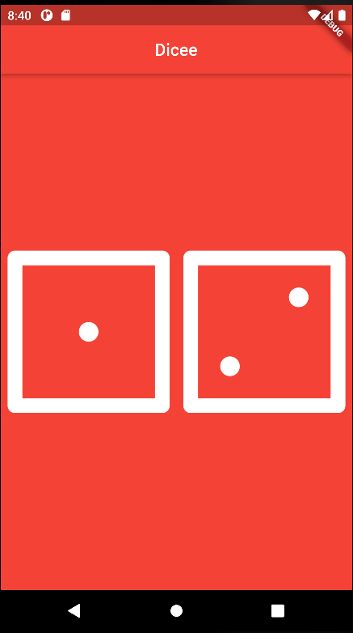

# Dice App

The Dice App is a simple mobile application that simulates rolling a dice. Each time the user presses a button, the app will display a random dice image, mimicking the experience of rolling a real dice.



## Features

- Pressing the "Dice images" button will generate a random number between 1 and 6 and display the corresponding dice image.
- The app provides a realistic dice rolling experience, allowing users to enjoy the randomness of a dice throw virtually.

## Technologies Used

The Dice App is built using the following technologies:

- Framework: Flutter
- Programming Language: Dart
- Integrated Development Environment: Android Studio

## Usage

To use the Dice App, follow these steps:

1. Clone the repository or download the source code.
2. Open the project in Android Studio.
3. Install the necessary dependencies by running the following command:
   ```
   flutter pub get
   ```
4. Connect your mobile device or start an emulator.
5. Build and run the app using Android Studio's run button or by running the following command:
   ```
   flutter run
   ```
# What you will learn

- How to use Flutter stateless widgets to design the user interface.
- How to use Flutter stateful widgets to update the user interface.
- How to change the properties of various widgets.
- How to use onClick listeners to detect when buttons are pressed.
- How to use setState to mark the widget tree as dirty and requiring update on the next render.
- How to use expanded to make widgets adapt to screen dimensions.
- Understand and use string interpolation.
- Learn about basic dart programming concepts such as data types and functions.
- Code and use gesture controls.

## Contributing

Contributions to the Dice App are welcome and encouraged. If you find any issues or have suggestions for improvement, please open an issue on the GitHub repository.

To contribute to the project, follow these steps:

1. Fork the repository.
2. Create a new branch for your feature/bug fix.
3. Make your changes and ensure they are working correctly.
4. Commit your changes and push them to your fork.
5. Submit a pull request, explaining the changes you made.


## Acknowledgements

The Dice App was created with the help of various open-source libraries and resources. Special thanks to the following:

- [Flutter](https://flutter.dev/) - An open-source UI toolkit for building natively compiled applications across multiple platforms.
- [Dart](https://dart.dev/) - A client-optimized programming language used for building mobile, web, and desktop applications.
- [Android Studio](https://developer.android.com/studio) - The official integrated development environment (IDE) for Android app development.


